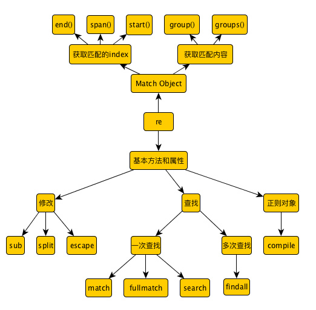

# 正则表达式

## 1. 使用方法

1. 首先`import re`

2. `re.mathch` 和 `re.search` 可以使用  
格式都是（pattern，string，flag）

3. __正则表达式前边一定记得加r!__

4. 

5. 常用方法总结



## 2. 元字符

```shell
.   除换行以外的任意字符
\w  字母或数字或下划线或汉字，即词（Word）
\s  任意空白符，即\n \t \r \v \f
\d  任意数字
\b  单词的开始或结尾，位置控制
^   字符串的开始，位置控制
$   字符串的结尾，位置控制
```

举例：
\ba\w*\b 以字母a开头的单词（仅匹配一个单词）

\bkb  以kb开头的内容

kb\b  以kb结束的内容

^\d{5,12}$ 匹配5到12位的数字

注：^...$和\b...\b等价，都用于匹配一个单词

## 3. 重复

```shell
*     重复零次或更多次，即任意次数
+     重复一次或更多次，即至少一次
？    重复零次或一次，即最多一次
{n}   重复n次
{n,}  重复至少n次
{n,m} 重复n到m次
```

## 4. 分支条件（或）“|”

## 5. 分组“（）”

小括号用于指定字表达式，也叫分组。字表达式可以用于多个字符的重复，即可以为字表达式指定重复次数。

```shell
(\d{1,3}.){3}\d{1,3}
```

一个简单的IP地址匹配表达式。

## 6反义，对元字符取反

```shell
\W     匹配不是字母数字下划线汉字的字符
\S     匹配任意不是空白的字符
\D     匹配不是数字的字符
\B     匹配不是单词开头或结尾的字符
[^sdf] 匹配除sdf以外的任意字符
```

## 7. 反向引用

使用小括号制定一个字表达式后，匹配这个字表达式文本（也就是次分组不活的内容）可以在表达式或其他程序中进一步处理（例如re模块的group和groups方法）。默认情况下每个分组拥有一个组号，规则是，从左到右，以分组的左括号为标志，第一个出现的分组的组号为1，第二个为2。。。__分组好为零对应整个正则表达式。__

```shell
\b(\w+)\b\s+\1\b
```

匹配重复的单词，例如“go go","and and"等

## 8. 贪婪与非贪婪

贪婪模式：匹配尽可能多的字符
非贪婪模式：匹配尽可能少的字符，在贪婪模式后加“？”

```shell
*?     重复任意次，但尽肯能少重复
+?     重复1次或更多次，但尽可能少重复
？？    重复0次或1次，但尽可能少重复
{n,m}? 重复n次到m次，但尽可能少重复
{n,}?  重复n次以上，但尽可能少重复
```

## 正则表达式修饰符 - 可选标志

正则表达式可以包含一些可选标志修饰符来控制匹配的模式。修饰符被指定为一个可选的标志。多个标志可以通过按位`OR或者|`它们来指定。如 `re.I | re.M` 被设置成 I 和 M 标志：

修饰符|描述
|:-:|:-|
re.I|使匹配对大小写不敏感
re.L|做本地化识别（locale-aware）匹配
re.M|多行匹配，影响 ^ 和 $
re.S|使 . 匹配包括换行在内的所有字符
re.U|根据Unicode字符集解析字符。这个标志影响 \w, \W, \b, \B.
re.X|该标志通过给予你更灵活的格式以便你将正则表达式写得更易于理解。

## re.sub(pattern,repl,string,count=0)

repl:替换后的字符串，也可以是个函数

count:模式匹配后替换的最大次数，默认0表示替换所有的匹配。

```python
data='I am a student'
print(re.sub('student','teacher',data))
```

```python
import re

data=['1 2017-04-11 Zjmainstay','2 2017-04-12 Nobody','3 2017-04-13 Somebody']

#这三个都实现匹配日期
for i in data:
    print(re.sub(r'[\d\-]{2,}',"hhh",i))
    print(re.sub(r'\b[\d\-]+\d\b',"hhh",i))
    print(re.sub(r'(?<=\s)[\d\-]+',"hhh",i))
    #前边是不可见字符，不会捕获，然后是数字或横线
```

## group()分组

见上面第五条

```python
import re
line='Cats are smarter than dogs'
pattern=re.search('(.*) are (.*?) .*',line,re.I|re.M)
if pattern:
    print(pattern.group())
    print(pattern.group(1)
    print(pattern,group(2))

输出：
Cats are smarter than dogs
Cats
smarter
```