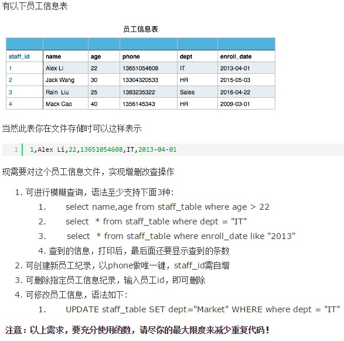
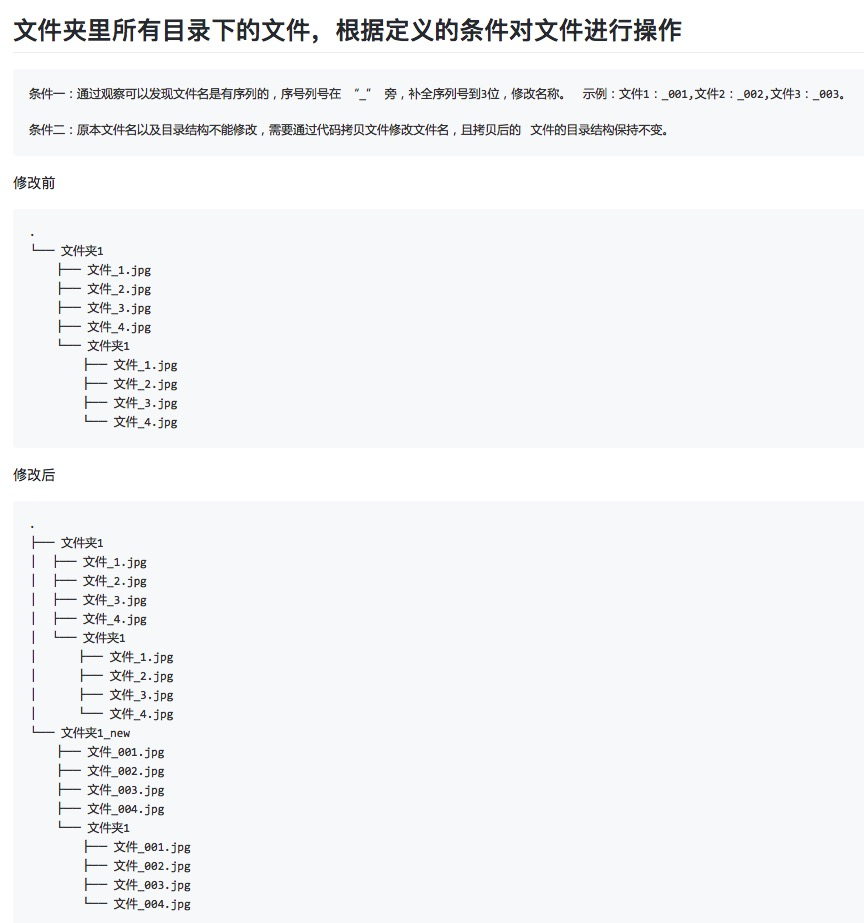

1 为什么 range 函数是左闭右开

2 生成一个100行内容的的文件, 做文件拆分, 写到10个文件, 每个文件10行

3 对里面的单词进行统计

4 

5 Python默认最大递归次数是多少,如果超过这个次数，会出现什么情况

6 Py文件 开头

`#!/usr/bin/env python`

`# -*- coding: utf-8 -*-`

有什么用

7.restful api的作用

8.

9.Stephan and Sophia forget about security and use simple passwords for everything. Help Nikola develop a password security check module. The password will be considered strong enough if its length is greater than or equal to 10 symbols, it has at least one digit, as well as containing one uppercase letter and one lowercase letter in it. The password contains only ASCII latin letters or digits.
Input: A password as a string.
Output: Is the password safe or not as a boolean or any data type that can be converted and processed as a boolean. In the results you will see the converted results.
checkio('A1213pokl') == False
checkio('bAse730onE') == True
checkio('asasasasasasasaas') == False
checkio('QWERTYqwerty') == False
checkio('123456123456') == False
checkio('QwErTy911poqqqq') == True

```python
def checkio(data):
        
    #replace this for solution
    return True or False

#Some hints
#Just check all conditions


if __name__ == '__main__':
    #These "asserts" using only for self-checking and not necessary for auto-testing
    assert checkio('A1213pokl') == False, "1st example"
    assert checkio('bAse730onE4') == True, "2nd example"
    assert checkio('asasasasasasasaas') == False, "3rd example"
    assert checkio('QWERTYqwerty') == False, "4th example"
    assert checkio('123456123456') == False, "5th example"
    assert checkio('QwErTy911poqqqq') == True, "6th example"
 print("done")
```

10.You are given a text, which contains different english letters and punctuation symbols. You should find the most frequent letter in the text. The letter returned must be in lower case.
While checking for the most wanted letter, casing does not matter, so for the purpose of your search, "A" == "a". Make sure you do not count punctuation symbols, digits and whitespaces, only letters.
If you have two or more letters with the same frequency, then return the letter which comes first in the latin alphabet. For example -- "one" contains "o", "n", "e" only once for each, thus we choose "e".
Input: A text for analysis as a string.
Output: The most frequent letter in lower case as a string.

```python
def checkio(text):
    
    #replace this for solution
    return 'a'

if __name__ == '__main__':
    #These "asserts" using only for self-checking and not necessary for auto-testing
    assert checkio("Hello World!") == "l", "Hello test"
    assert checkio("How do you do?") == "o", "O is most wanted"
    assert checkio("One") == "e", "All letter only once."
    assert checkio("Oops!") == "o", "Don't forget about lower case."
    assert checkio("AAaooo!!!!") == "a", "Only letters."
    assert checkio("abe") == "a", "The First."
    print("Start the long test")
    assert checkio("a" * 9000 + "b" * 1000) == "a", "Long."
    print("The local tests are done.")
```